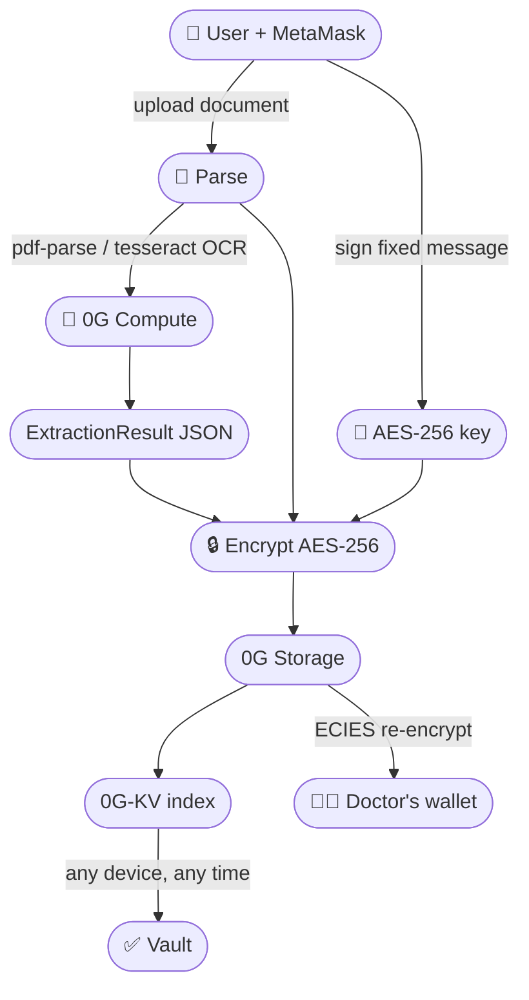

<div align="center">

# 🏥 MediVault

### Your private, AI-powered personal health vault — built on 0G.

*Your records are scattered. The jargon is confusing. You're scared to upload them anywhere.*
*MediVault fixes all three — privately, permanently, on-chain.*

[](https://medivault-ecru.vercel.app)
[](https://youtu.be/zyibyFRAVTY?si=f5Rr-oHN2UvYzZM9)
[](https://0g.ai/arena/zero-cup)
[](https://nextjs.org)
[](LICENSE)

**[🌐 Live App](https://medivault-ecru.vercel.app)** &nbsp;·&nbsp; **[▶️ Demo Video](https://youtu.be/zyibyFRAVTY?si=f5Rr-oHN2UvYzZM9)** &nbsp;·&nbsp; **[0G Zero Cup](https://0g.ai/arena/zero-cup)**

</div>

---

## 📸 Screenshots

### 🖥️ Desktop

<table>
<tr>
<td align="center" width="50%">

**Landing Page**


*Hero — "Your health history, cryptographically yours"*

</td>
<td align="center" width="50%">

**Vault Dashboard**


*All records, encrypted & indexed on 0G-KV*

</td>
</tr>
<tr>
<td align="center" width="50%">

**AI Summary**


*Plain-language explanation via 0G Compute*

</td>
<td align="center" width="50%">

**Doctor Sharing + QR**


*ECIES-encrypted share + emergency QR card*

</td>
</tr>
</table>

### 📱 Mobile

<table>
<tr>
<td align="center" width="25%">

**Landing**


</td>
<td align="center" width="25%">

**Vault**


</td>
<td align="center" width="25%">

**AI Summary**


</td>
<td align="center" width="25%">

**QR Scanner**


</td>
</tr>
</table>

> 📲 MediVault is a **PWA** — install it directly from your browser on iOS or Android. No app store needed.

---

## 🚨 The Problem

Medical records are the most important documents a person owns — yet they're the worst managed.

| Pain point | Reality |
|---|---|
| 📂 **Scattered** | Spread across clinic portals, PDFs, emails, and paper printouts |
| 😵 **Confusing** | Written in dense medical jargon most patients can't parse |
| 😰 **Risky to store** | Uploading to Google Drive or a random app means trusting a company forever |
| 🚫 **Unshareable** | No secure, instant way to hand a record to a new doctor |

> *Every year, patients show up to emergency rooms unable to recall their medications, allergies, or prior diagnoses — because their records are scattered across systems they can't access.*

---

## ✅ The Solution

MediVault is a **self-sovereign health vault**. Connect your MetaMask wallet — that's your identity, your key, your vault.

```
  Upload any document  →  AI explains it  →  Encrypted on 0G  →  Yours forever
```

### How it works

1. **Connect wallet** — MetaMask signs a fixed message; MediVault derives a deterministic AES-256 key. The key never leaves your browser.
2. **Upload** — Drop in a lab report, prescription, discharge summary, or image. PDF parsing + OCR handles any format.
3. **AI explains** — 0G Compute returns a plain-language summary, extracts conditions / medications / allergies / red flags, and flags anything urgent.
4. **Encrypt & store** — AES-256 ciphertext is uploaded to 0G Storage. The Merkle root hash is indexed in 0G-KV. Your server never sees plaintext.
5. **Vault rebuilds anywhere** — Open MediVault on any device, connect wallet, full history appears. No login. No server. No cloud backup.

---

## 🔑 Why 0G — Not IPFS, Not S3, Not Anything Else

Every feature in MediVault depends on a specific 0G primitive. Remove 0G and the product cannot exist.

| Feature | 0G primitive used |
|---|---|
| Permanent, verifiable encrypted storage | **0G Storage** — ciphertext with AES-256 v1 header + Merkle root |
| No central database, no server key | **Wallet identity** — key derived from wallet signature, never persisted |
| Tamper-proof record integrity | **Merkle root hash** — verifiable against 0G at any time |
| E2E share to a specific doctor | **ECIES** — encrypted to recipient's wallet public key (v2 header) |
| AI explanations and chat | **0G Compute** — OpenAI-compatible decentralized inference |
| Vault index rebuilds from scratch | **0G-KV** — record metadata and root hashes, keyed by wallet |

---

## ✨ Features

<table>
<tr>
<td width="50%">

**🔐 Wallet-native identity**
Connect MetaMask → AES-256 key derived in-browser from wallet signature. Zero passwords. Zero email.

**🧠 AI-powered explanations**
Every document gets a plain-language summary via 0G Compute. Multi-language. "Explain like I'm 5" toggle.

**🔒 Client-side encryption**
AES-256 before upload. 0G Storage receives ciphertext only. Server never sees your health data.

**✅ Tamper-proof integrity**
Merkle root hash on every record. One-click verification against 0G.

**📈 Health timeline + lab trends**
Chronological view across all records. Lab value charts vs. reference ranges.

</td>
<td width="50%">

**👩‍⚕️ E2E doctor sharing**
Share any record to a doctor's wallet address via ECIES encryption. Delivered to their received tab. Zero server relay.

**🩺 Doctor handoff + Emergency QR**
One-click printable handoff summary. Emergency QR card with blood type, allergies, and critical meds — save to your phone lock screen.

**💬 Chat across all records**
Ask questions across your entire vault with AI citations pointing to source documents.

**📲 PWA — works offline**
Installs as a home-screen app. Service worker caches the shell. Records accessible from local encrypted cache.

**🔗 Consent ledger**
Hash-chained audit trail on 0G of every share event — who, what, when.

</td>
</tr>
</table>

---

## 🏗️ Architecture



### Storage & Index Adapters

All 0G I/O is isolated behind two clean interfaces in `src/lib/og/adapters.ts`:

```ts
// Storage — upload, download, share, verify
interface StorageAdapter {
  uploadEncrypted(file, key): Promise<string>   // returns rootHash
  downloadDecrypted(rootHash, key): Promise<Blob>
  shareToRecipient(rootHash, recipientPubKey): Promise<void>
  verifyIntegrity(rootHash): Promise<boolean>
}

// Index — put, list, get record metadata
interface IndexAdapter {
  put(walletAddress, record): Promise<void>
  list(walletAddress): Promise<RecordMeta[]>
  get(walletAddress, rootHash): Promise<RecordMeta>
}
```

No mocks. No stubs. Both interfaces have exactly one implementation — the real 0G SDK.

---

## 🛡️ Security Model

```
Your wallet private key
        │
        ▼
  sign(fixedMessage)  ──→  AES-256 key  ──→  encrypts records
                                │
                          NEVER stored
                          NEVER sent to server
                          NEVER logged
```

- **Zero-knowledge server** — API routes process only ciphertext. Plaintext never touches the backend.
- **No recovery by design** — If you lose your wallet, you lose your vault. This is a feature, not a bug.
- **Rate-limited APIs** — Hybrid L1 in-process + L2 KV-backed rate limiter on all public endpoints.
- **ECIES sharing** — Uses `ethers.SigningKey.computePublicKey` + SDK ECIES header. Only the recipient's private key can decrypt.

---

## 🚀 Quick Start

### Prerequisites
- [MetaMask](https://metamask.io) browser extension
- Node.js 18+
- A [0G Compute API key](https://router-api.0g.ai)

### Run locally

```bash
git clone https://github.com/salch-cred/medivault
cd medivault
npm install
cp .env.example .env.local
# fill in API keys (see below)
npm run dev
# → http://localhost:3000
```

### Add 0G Mainnet to MetaMask

| Field | Value |
|---|---|
| Network name | 0G Mainnet |
| RPC URL | `https://evmrpc.0g.ai` |
| Chain ID | `16661` |
| Block explorer | `https://chainscan.0g.ai` |

Get free gas at **[faucet.0g.ai](https://faucet.0g.ai)** — uploading and indexing are on-chain operations.

---

## ⚙️ Environment Variables

**Server-side** (secret — never exposed to browser):

| Variable | Description |
|---|---|
| `AI_API_KEY` | 0G Compute API key |
| `AI_BASE_URL` | 0G Compute base URL (default: `https://router-api.0g.ai/v1`) |
| `AI_MODEL` | Model ID served by 0G Compute |

**Client-side** (`NEXT_PUBLIC_*`):

| Variable | Description |
|---|---|
| `NEXT_PUBLIC_ZG_RPC_URL` | `https://evmrpc.0g.ai` |
| `NEXT_PUBLIC_ZG_INDEXER_RPC` | `https://indexer-storage-turbo.0g.ai` |
| `NEXT_PUBLIC_ZG_CHAIN_ID` | `16661` |
| `NEXT_PUBLIC_ZG_FLOW_CONTRACT` | 0G flow contract address |
| `NEXT_PUBLIC_ZG_KV_NODE_URL` | 0G-KV node URL |
| `NEXT_PUBLIC_APP_URL` | Your deployed URL |
| `NEXT_PUBLIC_WALLETCONNECT_PROJECT_ID` | From [cloud.reown.com](https://cloud.reown.com) |

---

## 🛠️ Tech Stack

| Layer | Technology |
|---|---|
| Framework | Next.js 14 (App Router) |
| Blockchain | 0G Mainnet (chain 16661) via ethers v6 |
| Storage | `@0gfoundation/0g-storage-ts-sdk` |
| AI inference | 0G Compute (OpenAI-compatible) |
| Wallet | MetaMask + Web3Modal / WalletConnect |
| Encryption | AES-256 (v1) + ECIES (v2) via 0G SDK |
| OCR | `tesseract.js` (client-side) |
| PDF parsing | `pdf-parse` (server-side) |
| QR scanning | `jsqr` (cross-browser, iOS Safari safe) |
| UI | Tailwind CSS + shadcn/ui + Framer Motion |
| PWA | Service Worker + Web App Manifest |

---

## 🗺️ Roadmap

- [ ] Wallet-based access control lists — multi-doctor sharing + revocation
- [ ] Background key rotation and re-encryption
- [ ] Richer document types — insurance, vaccination records, genomics
- [ ] Native mobile app with on-device camera capture
- [ ] Provider-side inbox for received ECIES shares
- [ ] Selective-disclosure ZK proofs — prove a fact without revealing the record

---

## 📄 License

MIT — see [LICENSE](LICENSE)

---

<div align="center">

> ⚠️ MediVault explains and organizes your records. **It is not medical advice.** Always consult a qualified clinician.

**Built with ❤️ for the [0G Zero Cup](https://0g.ai/arena/zero-cup)**

[🌐 Live App](https://medivault-ecru.vercel.app) &nbsp;·&nbsp; [▶️ Demo](https://youtu.be/zyibyFRAVTY?si=f5Rr-oHN2UvYzZM9) &nbsp;·&nbsp; [0G Docs](https://docs.0g.ai)

</div>
