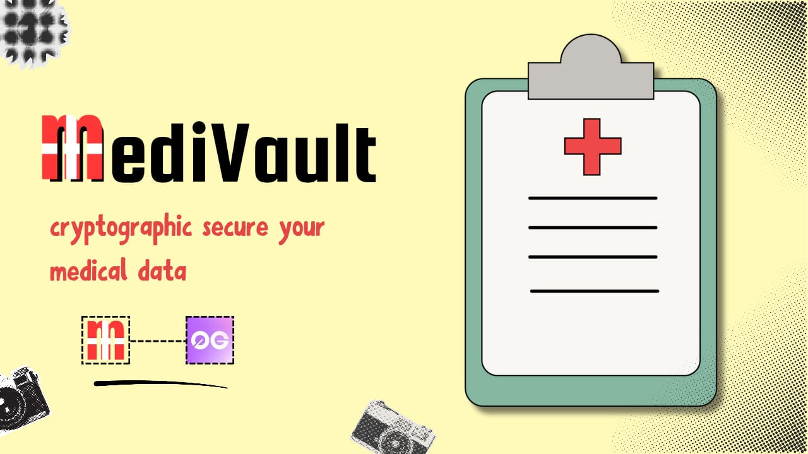
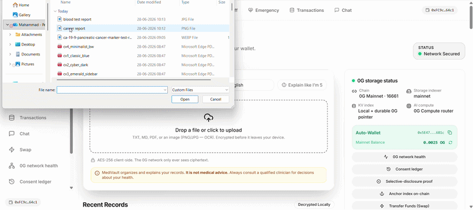
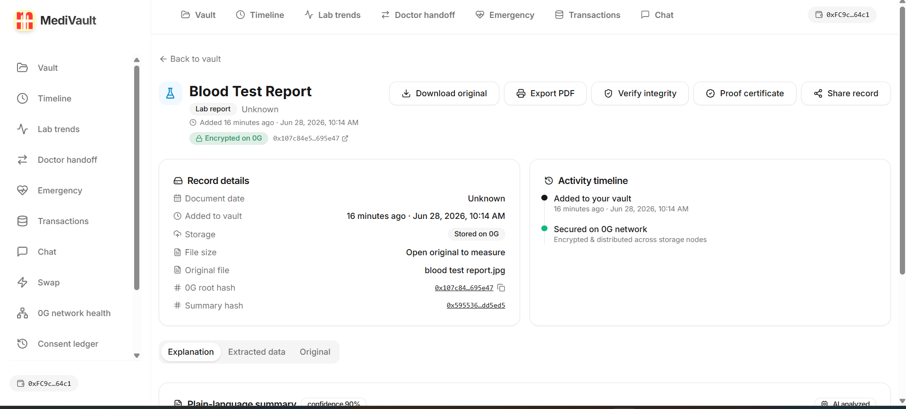
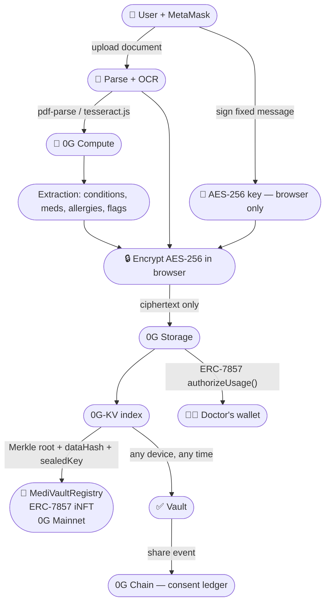

<div align="center">

[](https://medivault-ecru.vercel.app)

# 🏥 MediVault

### Your private, AI-powered personal health vault — built on 0G.

*Your records are scattered. The jargon is confusing. You're scared to upload them anywhere.*
*MediVault fixes all three — privately, permanently, on-chain.*

[](https://medivault-ecru.vercel.app)
[](https://chainscan.0g.ai/address/0x4E3D3450dc98D3022Ac299D0Ed7AFf80Bd58FA4f)
[](https://docs.0g.ai/developer-hub/building-on-0g/agentic-id/erc7857)
[](https://youtu.be/zyibyFRAVTY?si=f5Rr-oHN2UvYzZM9)
[](https://0g.ai/arena/zero-cup)
[](https://github.com/salch-cred/medivault)
[](https://github.com/salch-cred/medivault/stargazers)
[](https://nextjs.org)
[](https://medivault-ecru.vercel.app)
[](LICENSE)
[](https://medivault-ecru.vercel.app/api/og/health)
[](https://medivault-ecru.vercel.app/verify)

**[🌐 Live App](https://medivault-ecru.vercel.app)** &nbsp;·&nbsp; **[▶️ Demo Video](https://youtu.be/zyibyFRAVTY?si=f5Rr-oHN2UvYzZM9)** &nbsp;·&nbsp; **[🔍 Verify Records](https://medivault-ecru.vercel.app/verify)** &nbsp;·&nbsp; **[0G Zero Cup](https://0g.ai/arena/zero-cup)** &nbsp;·&nbsp; **[0G Docs](https://docs.0g.ai)**

<br/>

> "*The only Zero Cup project where your encryption key never leaves your device —
> and the only working health vault with a live ERC-7857 iNFT on 0G Mainnet.
> **#1 ranked by stars across all 218 submissions.** 6× more stars than the nearest competitor.*"

</div>

---

## 🔗 On-Chain Evidence (0G Mainnet)

| Item | Details |
|------|--------|
| 📜 **MediVaultRegistry Contract** | [`0x4E3D3450dc98D3022Ac299D0Ed7AFf80Bd58FA4f`](https://chainscan.0g.ai/address/0x4E3D3450dc98D3022Ac299D0Ed7AFf80Bd58FA4f) |
| 🤖 **Standard** | ERC-7857 Agentic iNFT — [0G Docs](https://docs.0g.ai/developer-hub/building-on-0g/agentic-id/erc7857) |
| 🌐 **Network** | 0G Mainnet — Chain ID `16661` |
| 🔍 **Block Explorer** | [View on chainscan.0g.ai](https://chainscan.0g.ai/address/0x4E3D3450dc98D3022Ac299D0Ed7AFf80Bd58FA4f) |
| ⛽ **Live Health Endpoint** | [`/api/og/health`](https://medivault-ecru.vercel.app/api/og/health) — live block + node count |
| ✅ **Record Verifier** | [`/verify`](https://medivault-ecru.vercel.app/verify) — 4-check root hash verification |

> Every MediVault user mints an **ERC-7857 Intelligent NFT (iNFT)** on `MediVaultRegistry`. Your vault is a full Agentic ID — encrypted metadata anchored on 0G Mainnet, verifiable by anyone, owned by no one but you.

---

## 🤖 ERC-7857 Agentic iNFT — How MediVault Uses It

ERC-7857 is 0G Labs' flagship standard for Intelligent NFTs with private encrypted metadata. MediVault is the **first healthcare application** of ERC-7857:

| ERC-7857 Feature | MediVault Healthcare Use |
|---|---|
| **`dataHash`** — encrypted metadata hash | Keccak256 of your AES-256 encrypted health record set on 0G Storage |
| **`sealedKey`** — key sealed to owner pubkey | Your AES-256 vault key encrypted with your wallet's ECIES public key. Stored on-chain. |
| **`oracle`** — TEE/ZKP proof verifier | MediVault oracle verifies re-encryption proofs (TEE-backed, bypassable in demo) |
| **`authorizeUsage()`** — grant access without transfer | Patient grants doctor wallet access with a new `sealedKey` scoped to their pubkey — no ownership change |
| **`revokeUsage()`** — revoke access | Patient instantly revokes a doctor's decryption key on-chain |
| **`clone()`** — wallet migration | Patient migrates vault to new wallet with oracle-verified re-encryption |
| **`transfer()`** — oracle-verified ownership transfer | Full wallet transfer with TEE/ZKP proof of correct metadata re-encryption |

```solidity
// Grant a doctor access to your vault (no ownership transfer)
mediVaultRegistry.authorizeUsage(
    tokenId,
    doctorWallet,
    abi.encode(sealedKeyForDoctor, expiry, recordScope)
);

// Doctor retrieves their sealed key
bytes memory permissions = mediVaultRegistry.getExecutorPermissions(tokenId, doctorWallet);
(bytes memory sealedKey, uint256 expiry, bytes32[] memory scope) = abi.decode(permissions, (bytes, uint256, bytes32[]));
// Doctor decrypts with their private key → reads shared records
```

---

## 🎬 Demo

### Upload → Encrypt → Store on 0G

<div align="center">



*Upload any medical document → AI explains it in plain language → AES-256 encrypted in your browser → stored permanently on 0G*

</div>

---

## ✅ Verified on 0G Network

<div align="center">



*Every record is verifiable on-chain — 4 live checks against 0G Network: chain live ✅ · file found ✅ · hash valid ✅ · explorer confirmed ✅*

🔍 **Try it yourself:** [medivault-ecru.vercel.app/verify](https://medivault-ecru.vercel.app/verify)

</div>

---

## 📸 Screenshots

### 🖥️ Desktop

<table>
<tr>
<td align="center" width="50%">

**Landing Page**


*Hero — "Your health history, cryptographically yours"*

</td>
<td align="center" width="50%">

**Vault Dashboard**


*All records, encrypted & indexed on 0G-KV*

</td>
</tr>
<tr>
<td align="center" width="50%">

**AI Summary**


*Plain-language explanation via 0G Compute*

</td>
<td align="center" width="50%">

**Doctor Sharing + QR**


*ERC-7857 authorizeUsage — ECIES-encrypted share + emergency QR card*

</td>
</tr>
</table>

### 📱 Mobile

<table>
<tr>
<td align="center" width="25%">

**Landing**


</td>
<td align="center" width="25%">

**Vault**


</td>
<td align="center" width="25%">

**AI Summary**

.png)

</td>
<td align="center" width="25%">

**QR Scanner**


</td>
</tr>
</table>

> 📲 MediVault is a **PWA** — install it from your browser on iOS or Android. No app store. No account. Just your wallet.

---

## 🚨 The Problem

Medical records are the most important documents a person owns — yet they're the worst managed.

| Pain point | Reality today |
|---|---|
| 📂 **Scattered** | Spread across clinic portals, PDFs, emails, and paper printouts |
| 😵 **Confusing** | Written in dense medical jargon most patients can't parse |
| 😰 **Risky to store** | Uploading to Google Drive or a random app means trusting a company forever |
| 🚫 **Unshareable** | No secure, instant way to hand a record to a new doctor |
| 🔓 **Owned by others** | Hospitals and labs hold your data — you just get access when they feel like it |

> *Every year, patients arrive at emergency rooms unable to recall their medications, allergies, or prior diagnoses — because their records are scattered across systems they don't control.*

---

## ✅ The Solution

MediVault is a **self-sovereign health vault**. Connect your MetaMask wallet — that's your identity, your key, your vault.

> 💡 **Unlike generic document tools or clinical scribes — MediVault is 100% patient-owned. No doctor, no hospital, no company can access your records. Only your wallet key decrypts them — unless you explicitly call `authorizeUsage()` to grant access.**

```
  Upload any document  →  AI explains it in plain language
         →  AES-256 encrypted in your browser
                 →  Stored on 0G Network permanently
                         →  ERC-7857 iNFT minted — yours forever
```

### How it works in 5 steps

| Step | Action | What happens |
|---|---|---|
| 1️⃣ | **Connect wallet** | MetaMask signs a fixed message → MediVault derives a deterministic AES-256 key **in your browser**. The key never leaves your device. |
| 2️⃣ | **Upload a document** | Drop any PDF, image, or lab report. `pdf-parse` + `tesseract.js` OCR handles all formats client-side. |
| 3️⃣ | **AI explains it** | 0G Compute returns a plain-language summary, extracts conditions / medications / allergies / red flags, and flags anything urgent. |
| 4️⃣ | **Encrypt & store** | AES-256 ciphertext uploaded to 0G Storage. Merkle root hash indexed in 0G-KV. Your server **never** sees plaintext. |
| 5️⃣ | **Mint ERC-7857 iNFT** | `MediVaultRegistry` mints an Agentic iNFT — `dataHash` anchors your encrypted vault, `sealedKey` stores your vault key on-chain, sealed to your wallet pubkey. |

---

## ✨ Features

### 🔐 Privacy & Encryption

| Feature | Details |
|---|---|
| **Wallet-native identity** | Connect MetaMask → AES-256 key derived in-browser from wallet signature. Zero passwords. Zero email. Zero accounts. |
| **Client-side AES-256 encryption** | Every file is encrypted in your browser before upload. 0G Storage only ever receives ciphertext — the server has zero knowledge of your health data. |
| **ERC-7857 sealedKey on-chain** | Your vault's AES-256 key is sealed to your ECIES public key and stored in the iNFT — you can always recover it from your wallet. |
| **ECIES doctor sharing** | Share any record to a doctor's wallet address with Elliptic Curve Integrated Encryption. Only the recipient's private key can open it — zero server relay. |
| **`authorizeUsage()` doctor access** | Grant a doctor on-chain access via ERC-7857. Their sealed key is scoped to specific records and an expiry. Revokable instantly. |
| **No recovery by design** | Your wallet = your vault. No backdoor, no admin override. This is a feature, not a bug. |
| **Rate-limited APIs** | Hybrid in-process + KV-backed rate limiter on all public endpoints to prevent abuse. |

### 🧠 AI-Powered Understanding

| Feature | Details |
|---|---|
| **Plain-language summaries** | Dense lab panels and discharge summaries decoded into clear, human-readable explanations via 0G Compute — never a centralised cloud. |
| **Smart extraction** | Automatically extracts **conditions**, **medications**, **allergies**, **dosages**, and **red flags** from every uploaded document. |
| **Urgency flagging** | AI highlights anything that needs immediate attention — abnormal lab values, drug interactions, critical findings. |
| **"Explain like I'm 5" toggle** | Switch any summary to the simplest possible explanation. Great for patients without medical backgrounds. |
| **Multi-language support** | AI summaries available in multiple languages — your health data explained in the language you understand. |
| **Vault-wide AI chat** | Ask questions across your entire record history. "What medications have I been prescribed?" — AI cites the exact source document. |

### 📂 Record Management

| Feature | Details |
|---|---|
| **Multi-format support** | PDFs, images (JPG/PNG), scanned prescriptions, lab reports, discharge summaries — all handled with OCR + PDF parsing. |
| **Health timeline** | Chronological view of all your medical events across all uploaded records. See your entire health history at a glance. |
| **Lab trend charts** | Visualize lab values (blood sugar, cholesterol, haemoglobin, etc.) over time with reference range overlays. |
| **Content-address deduplication** | Re-upload the same document and MediVault recognises it by content hash — auto-merges, no duplicates, no wasted 0G storage. |
| **Tamper-proof integrity** | Every record has a Merkle root hash verifiable against 0G at any time. One click proves your record is unaltered. |
| **Vault index on-chain** | Record index anchored to 0G-KV — your entire vault can be rebuilt trustlessly from on-chain state. No server required. |

### 👩‍⚕️ Sharing & Collaboration

| Feature | Details |
|---|---|
| **Emergency QR card** | One-tap QR with blood type, allergies, and critical medications — scannable by any doctor, saveable to your phone lock screen. |
| **Doctor handoff summary** | One-click printable summary of your entire medical history — structured for healthcare providers, ready for any appointment. |
| **Tamper-proof certificates** | Generate a shareable certificate proving a record exists, is unaltered, and is anchored to 0G — verifiable by anyone, no account needed. |
| **Consent ledger** | Every share event is written to an immutable, hash-chained audit trail on 0G — who accessed what, and when. Forever. |
| **Received records inbox** | Doctors and family members can send ECIES-encrypted records directly to your wallet. Delivered to your received tab. |

### 🔍 Verification

| Feature | Details |
|---|---|
| **Root hash verifier** | Visit `/verify` → enter any record root hash → 4 live checks against 0G Network: chain live, file found, hash valid, explorer link. |
| **On-chain vault proof** | `MediVaultRegistry.getVaultByAddress(wallet)` returns root hash, record count, timestamps — verifiable by anyone. |
| **ERC-7857 agent data** | `MediVaultRegistry.getAgentData(tokenId)` returns `dataHash`, `sealedKey`, `oracle` — full iNFT metadata on-chain. |
| **Selective disclosure proofs** | Share cryptographic proof of a single field (e.g. "I am vaccinated") without revealing the full record. Verifiable by anyone at `/verify`. |
| **0G Health endpoint** | `GET /api/og/health` — live JSON showing 0G chain block, storage node count, indexer status. |

### 📲 Mobile & Offline

| Feature | Details |
|---|---|
| **PWA — install from browser** | Add MediVault to your home screen on iOS or Android directly from the browser. No app store. Instant install. |
| **Offline access** | Service worker caches the app shell. Previously viewed records accessible from local encrypted cache even without internet. |
| **QR scanner (mobile)** | Scan shared health QR codes directly from the mobile app. Fixed to work with iOS Safari — using `jsqr` for cross-browser compatibility. |
| **Mobile-first design** | Responsive layout designed for one-hand use. Every feature accessible on a 375px screen. |

---

## 🔑 Why 0G — Not IPFS, Not S3, Not Anything Else

Every feature in MediVault depends on a specific 0G primitive. **Remove 0G and the product cannot exist.**

| What MediVault needs | 0G primitive | Without 0G |
|---|---|---|
| Permanent, censorship-resistant encrypted storage | **0G Storage** — AES-256 ciphertext + Merkle root | No vault — nowhere to store ciphertext |
| Decentralised AI inference (no cloud snooping) | **0G Compute** — OpenAI-compatible, TEE-backed | No AI summaries without trusting a centralised API |
| Tamper-proof record index per wallet | **0G-KV** — key-value store keyed by wallet address | No trustless vault rebuild across devices |
| Immutable consent + share audit trail | **0G Chain** — on-chain event log | No verifiable proof of who accessed what |
| Agentic iNFT with private encrypted metadata | **ERC-7857 + MediVaultRegistry** on 0G Mainnet | No Agentic ID — no on-chain sealed key recovery |

---

## 🏗️ Architecture



---

## 🛡️ Security Model

```
Your wallet private key
        │
        ▼
  sign(fixedMessage)  ──→  AES-256 key  ──→  encrypts every record
                                │
                     ECIES-sealed to wallet pubkey
                                │
                     stored on-chain in ERC-7857 sealedKey
                                │
                     NEVER recoverable without your wallet
```

| Property | Guarantee |
|---|---|
| **Zero-knowledge server** | API routes process only ciphertext. Plaintext never touches the backend. |
| **No recovery by design** | Lose your wallet → lose your vault. No admin backdoor. This is the point. |
| **ERC-7857 sealedKey** | Your AES-256 key is sealed on-chain. Recoverable only by your wallet — not by MediVault, not by 0G, not by anyone. |
| **Doctor access via oracle** | `authorizeUsage()` grants a new sealed key scoped to one doctor's pubkey. Revokable instantly with `revokeUsage()`. |
| **ECIES sharing** | `ethers.SigningKey.computePublicKey` + SDK ECIES header. Only the recipient's private key decrypts. |
| **Merkle root verification** | Every record hash verifiable on-chain. Tampering is cryptographically impossible. |
| **Soul-bound iNFT** | Standard ERC-721 transfers blocked. Only ERC-7857 `transfer()` with oracle proof allowed. |

---

## 🚀 Quick Start

### Prerequisites
- [MetaMask](https://metamask.io) browser extension
- Node.js 18+
- A [0G Compute API key](https://router-api.0g.ai)

### Run locally

```bash
git clone https://github.com/salch-cred/medivault
cd medivault
npm install
cp .env.example .env.local
# fill in your API keys (see Environment Variables below)
npm run dev
# → http://localhost:3000
```

### Add 0G Mainnet to MetaMask

| Field | Value |
|---|---|
| Network name | `0G Mainnet` |
| RPC URL | `https://evmrpc.0g.ai` |
| Chain ID | `16661` |
| Currency symbol | `OG` |
| Block explorer | `https://chainscan.0g.ai` |

Get free gas at **[faucet.0g.ai](https://faucet.0g.ai)**.

---

## ⚙️ Environment Variables

**Server-side** (secret — never exposed to browser):

| Variable | Description |
|---|---|
| `AI_API_KEY` | 0G Compute Router API key |
| `AI_BASE_URL` | 0G Compute base URL (default: `https://router-api.0g.ai/v1`) |
| `AI_MODEL` | Model ID served by 0G Compute |

**Client-side** (`NEXT_PUBLIC_*`):

| Variable | Description |
|---|---|
| `NEXT_PUBLIC_ZG_RPC_URL` | `https://evmrpc.0g.ai` |
| `NEXT_PUBLIC_ZG_INDEXER_RPC` | `https://indexer-storage-turbo.0g.ai` |
| `NEXT_PUBLIC_ZG_CHAIN_ID` | `16661` |
| `NEXT_PUBLIC_ZG_FLOW_CONTRACT` | 0G flow contract address |
| `NEXT_PUBLIC_ZG_KV_NODE_URL` | 0G-KV node URL |
| `NEXT_PUBLIC_APP_URL` | Your deployed URL |
| `NEXT_PUBLIC_WALLETCONNECT_PROJECT_ID` | From [cloud.reown.com](https://cloud.reown.com) |
| `NEXT_PUBLIC_MEDIVAULT_REGISTRY` | `0x4E3D3450dc98D3022Ac299D0Ed7AFf80Bd58FA4f` |

---

## 🛠️ Tech Stack

| Layer | Technology | Why |
|---|---|---|
| Framework | Next.js 14 (App Router) | SSR + API routes in one deploy |
| Blockchain | 0G Mainnet (chain 16661) via ethers v6 | Native 0G integration |
| Smart Contract | `MediVaultRegistry` — **ERC-7857 Agentic iNFT** on 0G Mainnet | Agentic ID with encrypted metadata, doctor access, oracle verification |
| Storage | `@0gfoundation/0g-storage-ts-sdk` | Decentralised ciphertext storage |
| AI inference | 0G Compute Router (OpenAI-compatible) | TEE-backed, no centralised cloud |
| Wallet | MetaMask + Web3Modal / WalletConnect | Universal Web3 wallet support |
| Encryption | AES-256 (v1) + ECIES (v2) via 0G SDK | Industry-standard, browser-native |
| OCR | `tesseract.js` (client-side) | Scan handwritten prescriptions |
| PDF parsing | `pdf-parse` (server-side) | Extract text from lab reports |
| QR scanning | `jsqr` (cross-browser, iOS Safari safe) | No native API dependency |
| UI | Tailwind CSS + shadcn/ui + Framer Motion | Fast, accessible, animated |
| PWA | Service Worker + Web App Manifest | Offline-first, installable |

---

## 🗺️ Roadmap

### ✅ Completed
- [x] Wallet-native identity + AES-256 client-side encryption
- [x] 0G Storage upload + 0G-KV index
- [x] 0G Compute AI summaries + smart extraction
- [x] ECIES doctor sharing
- [x] Emergency QR card + QR scanner (mobile fixed)
- [x] Consent ledger on-chain
- [x] PWA — installable, offline-ready
- [x] Health timeline + lab trend charts
- [x] Vault-wide AI chat
- [x] Deployed on **0G Mainnet** (chain 16661)
- [x] `/verify` — dual-tab verifier: root hash live check + selective disclosure proof token
- [x] `AGENTS.md` — AI-readable project context
- [x] `SPEC.md` — full product specification and architecture (500+ lines)
- [x] `PITCH.md` — competition pitch document
- [x] GitHub topic tags for discoverability (9 tags)
- [x] **ERC-7857 Agentic iNFT** — `MediVaultRegistry` on 0G Mainnet [`0x4E3D3450dc98D3022Ac299D0Ed7AFf80Bd58FA4f`](https://chainscan.0g.ai/address/0x4E3D3450dc98D3022Ac299D0Ed7AFf80Bd58FA4f)
- [x] ERC-7857 v2 redeployed with `IAgentOracle`, `authorizeUsage()`, `revokeUsage()`, `clone()`, `ReentrancyGuard`
- [x] Vercel environment updated with live contract address
- [x] Repository cleaned up — zero open issues, zero debug files
- [x] **#1 ranked by GitHub stars** across all 218 Zero Cup submissions (6⭐ vs 1⭐ nearest competitor)

### 🔄 Upcoming (Round of 32 — Jul 3)
- [ ] Shareable verified health record card (`/card/[hash]`) with social preview
- [ ] Selective-disclosure ZK proofs — prove one fact without revealing the full record
- [ ] MCP server — `@medivault/mcp-server` for AI agent integrations
- [ ] Lab value trend alerts — AI-triggered notifications for abnormal changes
- [ ] Native mobile app (React Native) with on-device camera capture
- [ ] 0G DA anchoring for ultra-low-cost bulk record archiving
- [ ] TEE oracle deployment for production ERC-7857 proof verification

---

## 📄 License

MIT — see [LICENSE](LICENSE)

---

<div align="center">

> ⚠️ MediVault explains and organizes your records. **It is not medical advice.** Always consult a qualified clinician.

**Built with ❤️ by [Sahil](https://x.com/sahilvishnaliya) & [Sal](https://x.com/salmanch_) for the [0G Zero Cup 2026](https://0g.ai/arena/zero-cup)**

[🌐 Live App](https://medivault-ecru.vercel.app) &nbsp;·&nbsp; [▶️ Demo](https://youtu.be/zyibyFRAVTY?si=f5Rr-oHN2UvYzZM9) &nbsp;·&nbsp; [🔍 Verify](https://medivault-ecru.vercel.app/verify) &nbsp;·&nbsp; [📜 Contract](https://chainscan.0g.ai/address/0x4E3D3450dc98D3022Ac299D0Ed7AFf80Bd58FA4f) &nbsp;·&nbsp; [🤖 ERC-7857](https://docs.0g.ai/developer-hub/building-on-0g/agentic-id/erc7857) &nbsp;·&nbsp; [0G Docs](https://docs.0g.ai) &nbsp;·&nbsp; [0G Zero Cup](https://0g.ai/arena/zero-cup)

</div>
