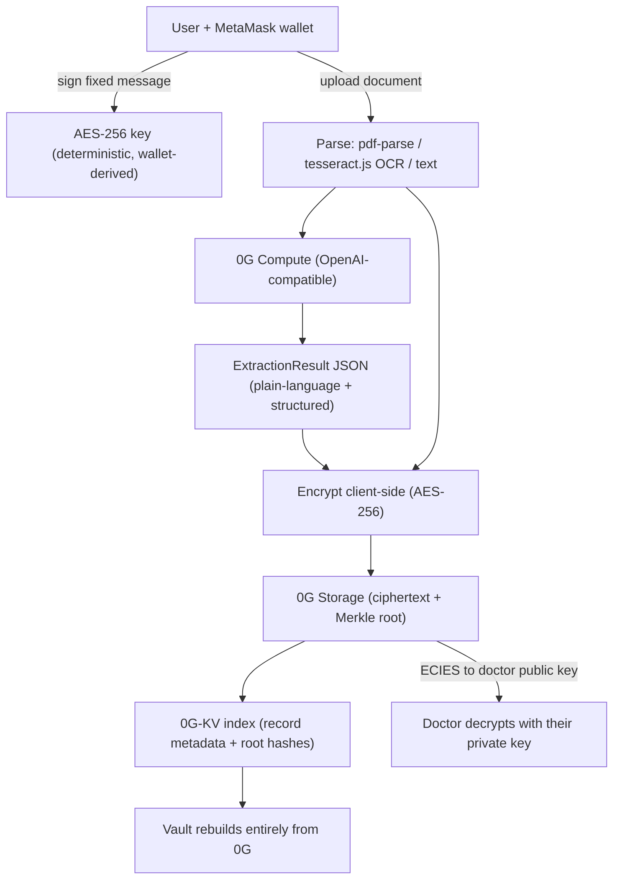

# MediVault

**Your private, AI-powered personal health vault — built on 0G.**

> Your medical records are scattered, confusing, and you’re scared to upload them anywhere. MediVault uses AI to explain them in plain language and stores them encrypted on 0G — owned by you, readable by no one else.

Built for the **0G Zero Cup** on the **0G Galileo Testnet (chain 16602)**.

---

## The problem

People accumulate lab reports, prescriptions, discharge summaries, and imaging results across many clinics and portals. They are:

- **Scattered** across PDFs, emails, paper, and portals.
- **Confusing** — dense medical jargon most people can’t parse.
- **Risky to store** — uploading sensitive health data to a random app means trusting a company’s database with your most private information.

## The solution

MediVault lets you connect a wallet and upload any medical document. The AI:

1. Explains it in **plain language**.
2. Extracts **structured health data** (conditions, medications, labs, allergies, follow-ups, red flags).
3. Builds a **chronological timeline** and **lab-trend charts**.
4. Generates a shareable **doctor handoff** and an **emergency QR card**.
5. Lets you **chat** across all your records with citations.

Everything is **encrypted client-side (AES-256) before upload** and stored on **0G decentralized storage**. Your wallet is your identity and holds your keys. There is **no central database** and **no server-side key recovery**.

---

## Why 0G is essential

Take 0G away and the product cannot exist. Each core capability maps directly to a 0G primitive:

| Feature | 0G primitive |
| --- | --- |
| Records encrypted before they ever leave the device | **0G Storage** stores ciphertext only (AES-256, v1 header) |
| True data ownership, no central DB | **Wallet identity** + keys derived from a wallet signature |
| Tamper-proof integrity | **Merkle root hash** per record, verifiable against 0G |
| Share a record with a specific doctor | **ECIES** encryption to the doctor’s wallet public key (v2 header) |
| Plain-language explanations + chat | **0G Compute** (OpenAI-compatible decentralized inference) |
| Vault rebuilds with no server | **0G-KV** index of record metadata / root hashes |

---

## Architecture



### Adapters

Storage and indexing are isolated behind two interfaces (`src/lib/og/adapters.ts`):

- **`StorageAdapter`** → `OgStorageAdapter` (`src/lib/og/storage-adapter.ts`): `uploadEncrypted`, `downloadDecrypted`, `shareToRecipient`, `verifyIntegrity` over the real 0G Storage SDK.
- **`IndexAdapter`** → `KvIndexAdapter` (`src/lib/og/kv-index-adapter.ts`): `put`, `list`, `get` over real **0G-KV**.

These are the only implementations — there are no mock versions.

---

## Features

- 🔐 Connect MetaMask; derive an AES-256 key from a wallet signature
- 📄 Upload TXT/MD/PDF (server `pdf-parse`) and images (client `tesseract.js` OCR)
- 🧠 AI extraction → `ExtractionResult` via 0G Compute
- 🗣️ Plain-language explanation, multi-language, and an “Explain like I’m 5” toggle
- 🔒 AES-256 client-side encryption + upload to 0G + root hash stored in 0G-KV
- ✅ “Encrypted on 0G” badge + root hash + tamper-proof integrity verification on every record
- 📈 Health timeline and lab-trend charts vs. reference ranges
- 🩺 Doctor handoff summary (print / save PDF) and emergency QR card
- 👩‍⚕️ ECIES share-to-doctor (encrypt to a recipient wallet public key)
- 💬 Chat across all records with citations

---

## Local setup

```bash
# 1. Install
npm install

# 2. Configure environment
cp .env.example .env.local
# then fill in the values (see below)

# 3. Run
npm run dev
# open http://localhost:3000
```

You’ll need the **MetaMask** browser extension. Add the **0G Galileo Testnet**:

- RPC URL: `https://evmrpc-testnet.0g.ai`
- Chain ID: `16602`
- Block explorer: `https://chainscan-galileo.0g.ai`

### Get free testnet tokens

Uploading to 0G Storage and writing the 0G-KV index are on-chain operations, so you need a small amount of testnet gas:

1. Open the faucet: **https://faucet.0g.ai**
2. Paste your wallet address and request tokens.
3. Confirm the balance in MetaMask, then upload your first document.

---

## Environment variables

Server-side (never exposed to the browser):

| Variable | Description |
| --- | --- |
| `AI_BASE_URL` | 0G Compute OpenAI-compatible base URL (`https://router-api.0g.ai/v1`) |
| `AI_API_KEY` | Your 0G Compute API key |
| `AI_MODEL` | Model id served by 0G Compute |

Client-side (`NEXT_PUBLIC_*`, used by the wallet/SDK in the browser):

| Variable | Description |
| --- | --- |
| `NEXT_PUBLIC_ZG_RPC_URL` | `https://evmrpc-testnet.0g.ai` |
| `NEXT_PUBLIC_ZG_INDEXER_RPC` | `https://indexer-storage-testnet-turbo.0g.ai` |
| `NEXT_PUBLIC_ZG_CHAIN_ID` | `16602` |
| `NEXT_PUBLIC_ZG_KV_NODE_URL` | 0G-KV node URL (turbo testnet) |
| `NEXT_PUBLIC_ZG_FLOW_CONTRACT` | 0G flow contract address |
| `NEXT_PUBLIC_APP_URL` | Your app URL (used for share links) |

See `.env.example` for the full list with defaults.

---

## 0G integration notes

- **SDK:** `@0gfoundation/0g-storage-ts-sdk` (v1.2.6+ for encryption) with `ethers` v6.
- **Upload** uses `indexer.upload(blob, RPC_URL, signer, { encryption: { type: 'aes256', key } })`.
- **Download + decrypt** uses `indexer.downloadToBlob(rootHash, { proof: true, decryption: { symmetricKey: key } })` — `download()` does not decrypt.
- **Mode detection** via `indexer.peekHeader(rootHash)` (null = plaintext, v1 = aes256, v2 = ecies).
- **ECIES** uses `ethers.SigningKey.computePublicKey(pubKey, true)` + `{ encryption: { type: 'ecies', recipientPubKey } }`.
- **0G-KV** writes via `indexer.selectNodes(1)` + `Batcher` + `streamDataBuilder.set(...)` + `batcher.exec()`, and reads via `KvClient.getValue(streamId, ethers.encodeBase64(keyBytes))`.
- **Browser polyfills:** `next.config.mjs` provides `Buffer`/`process` and Node core fallbacks for the bundler.
- Reference: the official starter kit — https://github.com/0gfoundation/0g-storage-ts-starter-kit

### Security model

- The AES-256 key is derived deterministically from a wallet signature over a fixed message, so it can always be regenerated from the wallet. It is never persisted or sent anywhere.
- Only ciphertext is uploaded. Plaintext health data and keys are never logged.
- There is no server-side key recovery. If you lose access to your wallet, you lose access to your vault — by design.

> ⚠️ MediVault organizes and explains your records. **It is not medical advice.** Always consult a qualified clinician.

> ℹ️ This is testnet software for a hackathon. The 0G SDK runtime API is version-sensitive; pin `@0gfoundation/0g-storage-ts-sdk` to a tested version and verify against the starter kit if upload/download behavior changes. Functional icons use `lucide-react`.

---

## Roadmap

- Wallet-based access control lists for multi-doctor sharing and revocation
- Background re-encryption / key rotation
- More document types (insurance, vaccination, genomics) and richer OCR
- Native mobile app with on-device camera capture
- Optional encrypted backup-to-self across devices
- Provider-side “inbox” for received ECIES shares

---

## License

MIT
